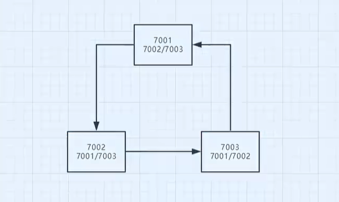
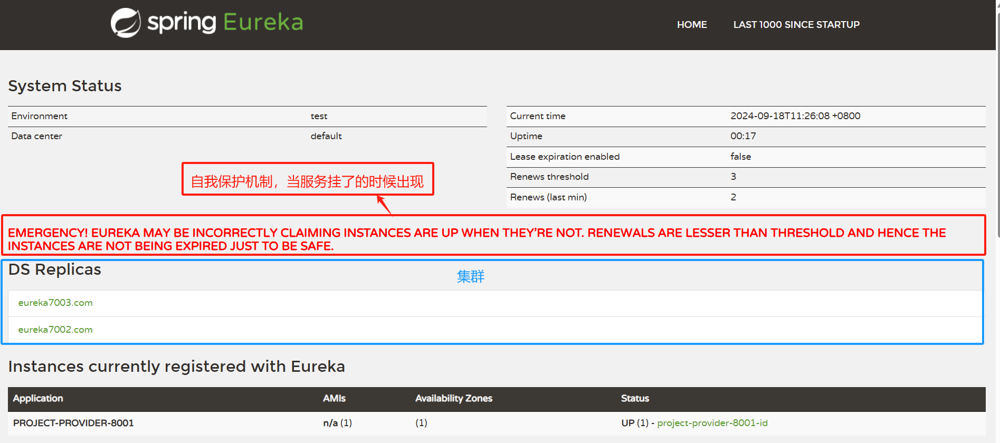

## 服务集群

> 什么是服务集群？比如有三个微服务，他们之间互相绑定，形成了一个集群，他们之间<font color=red>可以互相调用</font>，也可以<font color=red>互相访问</font>。好处是当其中一个服务挂掉了，其他的服务还可以继续运行。用户可以通过其他服务获取信息，不影响用户体验。

### 修改本地域名映射

> C 盘/windows/system32/drivers/etc/hosts 文件，添加如下映射；此时在本地访问 eureka7001.com，eureka7002.com，eureka7003.com 都会映射到 127.0.0.1，即本机。

```text
127.0.0.1 eureka7001.com
127.0.0.1 eureka7002.com
127.0.0.1 eureka7003.com
```

### 集群服务搭建

### 1. 在父项目(ths-spring-cloud)中再创建两个模块，并导入依赖

```xml
<dependencies>
  <!--Eureka Server 注册中心-->
  <dependency>
    <groupId>org.springframework.cloud</groupId>
    <artifactId>spring-cloud-starter-eureka-server</artifactId>
    <version>1.4.6.RELEASE</version>
  </dependency>
  <!--热部署-->
  <dependency>
    <groupId>org.springframework.boot</groupId>
    <artifactId>spring-boot-devtools</artifactId>
  </dependency>
</dependencies>
```

### 2. 将 project-eureka-7001 模块中的配置文件复制到 7002 和 7003 模块中，并修改配置文件

#### 修改 7001

```yaml
server:
  port: 7001
# Eureka 配置
eureka:
  instance:
    # 在Eureka注册中心的名字
    # hostname: localhost 修改了本地域名映射
    hostname: eureka7001.com
  client:
    # 是否向Eureka注册中心注册自己
    register-with-eureka: false
    # 是否从Eureka注册中心获取服务列表(false: 因为当前就是注册中心,即服务端)
    fetch-registry: false
    # Eureka 监控中心地址
    serviceUrl:
      # 目前取到的地址就是 https://localhost:7001/eureka/
      # 这是单机，即单个服务端，所以默认Zone就是当前服务
      # defaultZone: http://${eureka.instance.hostname}:${server.port}/eureka/
      # 集群(除了本机，还要关联其他服务)
      defaultZone: http://eureka7002.com:7002/eureka/,
      http://eureka7003.com:7003/eureka/
```

#### 修改 7002

```yaml
server:
  port: 7002
eureka:
  instance:
    hostname: eureka7002.com
  client:
    register-with-eureka: false
    fetch-registry: false
    serviceUrl:
      # 集群互相关联
      defaultZone: http://eureka7001.com:7001/eureka/,
      http://eureka7003.com:7003/eureka/
```

### 修改 7003

```yaml
server:
  port: 7003
eureka:
  instance:
    hostname: eureka7003.com
  client:
    register-with-eureka: false
    fetch-registry: false
    serviceUrl:
      # 集群互相关联
      defaultZone: http://eureka7002.com:7002/eureka/,
      http://eureka7001.com:7001/eureka/
```

### 3. 将服务注册到集群

> 原本服务只需要注册到单机，现在集群环境，当然是需要发布到集群中，即多个注册中心。

#### 修改 project-provider-dept-8001 模块的配置文件

```yaml
server:
  port: 8001
# mybatis配置
mybatis:
  # 配置别名：实体类包名路径(api模块)
  type-aliases-package: com.ths.api.pojo
  # 配置mapper接口的位置(当前模块)
  mapper-locations: classpath:mybatis/mapper/*.xml
  # 配置全局配置文件(当前模块)
  config-location: classpath:mybatis/mybatis-config.xml
# spring配置
spring:
  application:
    name: project-provider-8001
  datasource:
    type: com.alibaba.druid.pool.DruidDataSource
    driver-class-name: com.mysql.cj.jdbc.Driver
    url: jdbc:mysql://localhost:3306/db01?useUnicode=true
      &characterEncoding=utf-8&serverTimezone=UTC
    username: root
    password: 123456
# Eureka配置
eureka:
  client:
    serviceUrl:
      # 将本服务注册到哪个注册中心(单机)
      # defaultZone: http://localhost:7001/eureka/
      # 集群
      defaultZone: http://eureka7001.com:7001/eureka/,
      http://eureka7002.com:7002/eureka/,http://eureka7003.com:7003/eureka/
  # 修改服务在注册中心的名字
  instance:
    instance-id: project-provider-8001-id
# 配置监控信息(访问地址: http://localhost:8001/actuator/info)
info:
  app.name: project-provider-8001
  app.description: project-provider-8001
  company.name: ths
```



