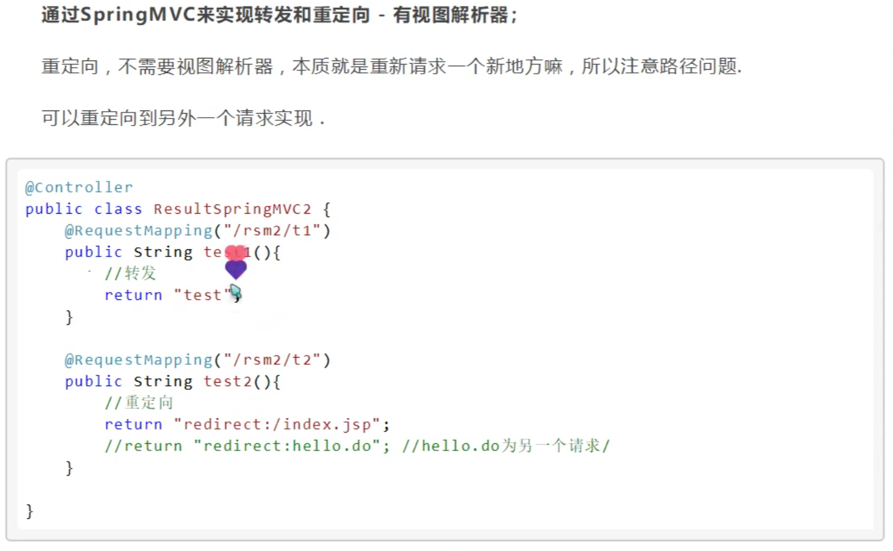

<!-- @format -->

## SpringMvc 转发和重定向

> 有没有视图解析器，都可以实现转发和重定向

### 转发和重定向的区别

- 转发：url 不会改变，服务器端行为
- 重定向：url 会改变，客户端行为

### 转发

```java
// 有视图解析器
return "success";
// 没有视图解析器
return "/success.jsp";
```

### 重定向

> <font color=red>注意是 redirect:/，不是 redirect:</font>

```java
// 有视图解析器
return "redirect:/success";
// 没有视图解析器
return "redirect:/success.jsp";
```


