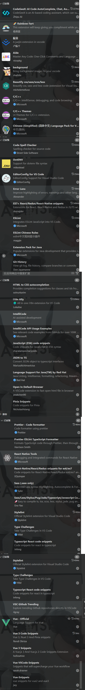

### 大数据学习路线图

1. java 基础
2. mysql
3. linux
4. hadoop（hive、sqoop、azkaban/oozie、flume）
5. scala
6. spark（core、sql、streaming、kafka）
7. flink

```json
// vscode 配置
{
  // 终端配置
  "terminal.integrated.shell.windows": "C:\\Windows\\System32\\WindowsPowerShell\\v1.0\\powershell.exe",

  // 文件自动保存配置
  "files.autoSave": "afterDelay", // 自动保存设置
  "files.autoSaveDelay": 1000, // 自动保存延迟时间（毫秒）

  // Git 配置
  "git.autofetch": true, // 自动获取git更新
  "git.enableSmartCommit": true, // 启用智能提交
  "git.confirmSync": false, // 同步时不确认
  "git.openRepositoryInParentFolders": "never", // 从不在父文件夹中打开仓库

  // Github Gist 配置
  "GithubGistExplorer.explorer.gistSortBy": "Last Updated", // Gist排序方式
  "GithubGistExplorer.explorer.gistAscending": false, // Gist排序顺序
  "GithubGistExplorer.explorer.subscriptionSortBy": "Last Updated", // 订阅Gist排序方式
  "GithubGistExplorer.explorer.subscriptionAscending": false, // 订阅Gist排序顺序

  // GitHub 趋势配置
  "vsc-github-trending.languages": [
    "react",
    "electron",
    "css",
    "html",
    "javascript",
    "typescript",
    "vue",
    "java",
    "php",
    "python",
    "ruby",
    "rust"
  ],
  "vsc-github-trending.selectedInterval": "daily", // GitHub趋势选择的时间间隔
  "vsc-github-trending.selectedLanguage": "javascript,css,html,typescript,vue,react,electron", // GitHub趋势选择的语言

  // 代码编辑配置
  "editor.tabSize": 2, // 制表符大小
  "editor.detectIndentation": false, // 不自动检测缩进
  "editor.suggest.preview": true, // 预览编辑器建议
  "editor.suggest.snippetsPreventQuickSuggestions": false, // 代码片段不阻止快速建议

  // 文件关联配置
  "files.associations": {
    "*.html": "html" // 将所有html文件关联到html语言
  },

  // JavaScript 和 TypeScript 配置
  "js/ts.implicitProjectConfig.experimentalDecorators": true, // 启用实验性装饰器

  // ESLint 和 Stylelint 配置
  "eslint.validate": [
    "javascript",
    "javascriptreact",
    "vue",
    "typescript",
    "typescriptreact",
    { "language": "html", "autoFix": true },
    { "language": "vue", "autoFix": true }
  ],
  "stylelint.validate": ["css", "less", "postcss", "scss", "vue", "sass"],

  // 代码格式化配置
  "editor.formatOnSave": false, // 保存时不自动格式化
  "editor.defaultFormatter": "esbenp.prettier-vscode", // 默认格式化工具
  "[vue]": {
    "editor.defaultFormatter": "esbenp.prettier-vscode" // Vue文件默认格式化工具
  },
  "[typescript]": {
    "editor.defaultFormatter": "hb432.prettier-eslint-typescript" // TypeScript文件默认格式化工具
  },
  "[html]": {
    "editor.defaultFormatter": "vscode.html-language-features" // HTML文件默认格式化工具
  },
  "editor.codeActionsOnSave": {
    "source.fixAll": "never", // 保存时不自动修复
    "source.fixAll.eslint": "never", // ESLint不自动修复
    "source.fixAll.stylelint": "never" // Stylelint不自动修复
  },

  // 差异编辑器配置
  "diffEditor.ignoreTrimWhitespace": false, // 比较时忽略空白

  // 其他配置
  "explorer.confirmDelete": false, // 删除文件时不确认
  "explorer.confirmPasteNative": false, // 粘贴时不确认
  "explorer.confirmDragAndDrop": false, // 拖拽时不确认
  "editor.fontLigatures": false, // 不使用字体连字

  // 背景配置
  "background.fullscreen": {
    "images": ["file:///D:/A-Folders/2-个人/百天照/6x6皮册/1030-百天照.jpg"], // 全屏背景图片
    "opacity": 0.91, // 背景透明度
    "size": "cover", // 背景大小
    "position": "center", // 背景位置
    "interval": 0 // 背景切换间隔
  },
  "background.style": {
    "background-position": "100% 100%", // 背景位置
    "background-size": "auto", // 背景大小
    "opacity": 1 // 背景透明度
  },

  // 隐私和语言配置
  "redhat.telemetry.enabled": true, // 启用红帽遥测
  "Codegeex.Privacy": true, // 启用Codegeex隐私
  "Codegeex.Comment.LanguagePreference": "中文", // Codegeex评论语言偏好设置为中文

  // 错误提示配置
  "errorLens.exclude": [
    "Option 'suppressImplicitAnyIndexErrors' is deprecated and will stop functioning in TypeScript 5\\.5\\. Specify compilerOption '\"ignoreDeprecations\": \"5\\.0\"' to silence this error\\."
  ],

  // 彩虹括号配置
  "RainbowBrackets.depreciation-notice": false, // 彩虹括号弃用通知

  // Codegeex许可证
  "Codegeex.License": "" // Codegeex许可证
}
```



在 VS Code 中开发 Vue 或 React 项目时，拥抱 TypeScript 的一些优秀插件包括：

Vetur：这是 Vue 2 的官方 VS Code 插件，提供语法高亮、代码片段、自动补全等功能，并且支持 TypeScript
。

Vue Language Features (Volar)：这是 Vue 3 的官方推荐插件，支持 TypeScript 并且提供 Vue 单文件组件中的 TypeScript 支持
。

TypeScript Vue Plugin (Volar)：这个插件提供了 Vue 单文件组件中的 TypeScript 支持，并且有跳转定义、类型检查等功能
。

TypeScript Import Sorter：这个插件可以自动帮助你排序 TypeScript 导入的模块
。

TypeScript Hero：可以帮助你快速重构 TypeScript 代码，包括重命名、提取函数等
。

ESLint：代码风格检查工具，可以通过配置文件自定义规则，支持 TypeScript
。

Prettier：代码格式化工具，可以根据配置格式化代码，让你的代码更加整洁易读，支持 TypeScript
。

Reactjs code snippets：为 React 开发提供代码片段，提高开发效率
。

JavaScript (ES6) code snippets：提供 ES6 代码片段，支持 TypeScript
。

Typescript React code snippets：提供 TypeScript 和 React 相关的代码片段
。

Vue VSCode Snippets：提供 Vue 代码片段，支持 Vue2 和 Vue3，可以快速生成代码
。

Vue Peek：快速定位 Vue 组件和模板
。

Auto Rename Tag：自动重命名匹配的 HTML 标签，支持 Vue 和 React
。

Bracket Pair Colorizer：给代码块的括号加上颜色，方便区分
。

Path Intellisense：自动提示文件路径和文件名，避免手动输入错误
。

Debugger for Chrome：在 VSCode 中调试 Vue 或 React 应用时需要使用的工具
。

这些插件可以帮助你在开发 Vue 或 React 项目时更好地利用 TypeScript，提高开发效率和代码质量。
