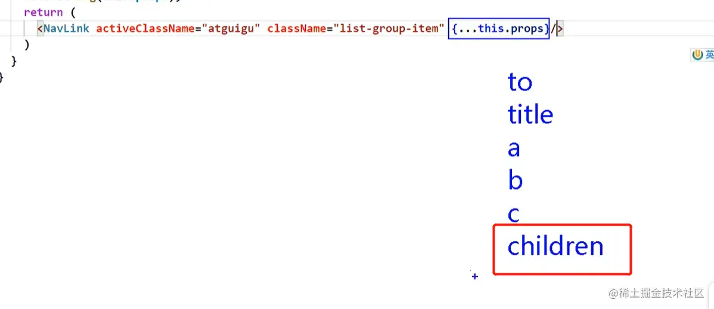

## react-router

> React Router 是一个标准的库，用于在 React 应用程序中实现路由功能。它允许你将 URL 路径与 React 组件关联起来，从而实现单页应用（SPA）的导航。

### 安装 React Router

> 使用 npm 或 yarn 安装 React Router：

```bash
npm install react-router-dom
# 或者
yarn add react-router-dom
```

| 组件名        | 作用                                    |
| ------------- | --------------------------------------- |
| BrowserRouter | 使用 HTML5 的 history API 来管理路由。  |
| HashRouter    | 使用 URL 的 hash 部分（#）来管理路由。  |
| Routes        | 包含多个 Route 组件，用于定义路由规则。 |
| Route         | 定义单个路由规则。                      |
| Link          | 页面跳转,没有高亮的效果。               |
| NavLink       | 页面跳转,可以实现高亮的效果             |
| Outlet        | 嵌套路由, 在父级内用来占位, 显示子路由; |
| useRoutes     | 动态路由,根据路由配置生成路由规则;      |
| Navigate      | 路由重定向;                             |
| useNavigate   | 跳转并传值;                             |
| useLocation   | 接收跳转传过来的值;                     |
| useParams     | 获取路由参数;                           |
| Switch 组件   | 路由中做单页面匹配                      |
| Redirect 组件 | 页面找不到，重定向                      |

### BrowserRouter

> BrowserRouter 是 React Router 中最常用的组件，它使用 HTML5 的 history API 来管理路由。

```jsx
import { BrowserRouter as Router, Routes, Route } from "react-router-dom";
import Home from "./Home";
import About from "./About";

function App() {
  return (
    <Router>
      <Routes>
        <Route path="/" element={<Home />} />
        <Route path="/about" element={<About />} />
      </Routes>
    </Router>
  );
}
```

### Routes 和 Route

> 在 React Router v6 中，Routes 和 Route 用于定义应用的路由结构。

```jsx
import { Routes, Route } from "react-router-dom";

function App() {
  return (
    <Routes>
      <Route path="/" element={<Home />} />
      <Route path="/about" element={<About />} />
    </Routes>
  );
}
```

### 导航链接(Link、NavLink)

> Link 组件用于在应用中创建导航链接。

```jsx
import { Link } from "react-router-dom";

function Navigation() {
  return (
    <nav>
      <Link to="/">Home</Link>
      <Link to="/about">About</Link>
    </nav>
  );
}
```

### 嵌套路由(Outlet)

```jsx
import { Outlet } from "react-router-dom";

function Dashboard() {
  return (
    <div>
      <h2>Dashboard</h2>
      <Outlet /> {/* 这里将渲染嵌套的子路由 */}
    </div>
  );
}
```

### Navigate

> Navigate 组件用于重定向到另一个路由。

```jsx
import { Navigate } from "react-router-dom";

function App() {
  return (
    <Routes>
      <Route path="/" element={<Home />} />
      <Route path="/about" element={<About />} />
      <Route path="/dashboard" element={<Navigate to="/about" />} />
    </Routes>
  );
}
```

### useRoutes

> useRoutes 是 React Router v6 中新增的一个 Hook，用于定义路由结构。

```jsx
import { useRoutes } from "react-router-dom";

function App() {
  const routes = useRoutes([
    { path: "/", element: <Home /> },
    { path: "/about", element: <About /> },
    { path: "/dashboard", element: <Dashboard /> },
  ]);

  return routes;
}
```

### useNavigate

> useNavigate 用来跳转页面并传递参数。

```jsx
import { useNavigate } from "react-router-dom";

function App() {
  const navigate = useNavigate();

  function handleClick() {
    navigate("/about", { state: { from: "App" } });
  }

  return <button onClick={handleClick}>Go to About</button>;
}
```

### useLocation 获取信息

> 使用 useLocation 来获取当前的路径信息和跳转传过来的值。

```jsx
import { useLocation } from "react-router-dom";

function App() {
  const location = useLocation();
  console.log(location.pathname); // 获取当前路径
  console.log(location.state); // 获取跳转传过来的值
  return <div>App</div>;
}
```

### 动态路由

> 动态路由允许你匹配 URL 中的参数。

```jsx
import { useParams } from "react-router-dom";

const User = () => {
  const { userId } = useParams();
  return <div>User ID: {userId}</div>;
};
```

### Switch 组件

> Switch 用来路由中做单独匹配(模糊匹配时，从上到下只匹配一个路由)，提高效率。

```jsx
import { Switch, Route } from "react-router-dom";

function App() {
  return (
    <Switch>
      <Route path="/about" element={<About />} />
      <Route path="/dashboard" element={<Dashboard />} />
      <Route path="/" element={<Home />} />
    </Switch>
  );
}
```

#### exact 属性

> Switch 组件中的 Route 可以添加 exact 属性，表示精确匹配。

```jsx
import { Switch, Route } from "react-router-dom";

function App() {
  return (
    <Switch>
      <Route exact path="/" element={<Home />} />
      <Route exact path="/about" element={<About />} />
    </Switch>
  );
}
```

### Redirect 组件

> Redirect 组件用于重定向到另一个路由。

```jsx
import { Redirect } from "react-router-dom";

function App() {
  return (
    <Routes>
      <Route path="/" element={<Home />} />
      <Route path="/about" element={<About />} />
      <Route path="/dashboard" element={<Redirect to="/about" />} />
      {/* 放到页面最下方，当所有路由都无法匹配时，跳转到Redirect指定的页面 */}
      <Redirect to="/404" />
    </Routes>
  );
}
```

### 路由守卫

> 在 React Router v6 中，可以使用 useNavigate 和 useLocation 来实现路由守卫。

```jsx
import { useNavigate, useLocation } from "react-router-dom";

function PrivateRoute() {
  const navigate = useNavigate();
  const location = useLocation();

  useEffect(() => {
    const isAuthenticated = checkAuthentication(); // 自定义认证函数

    if (!isAuthenticated) {
      navigate("/login", { state: { from: location } });
    }
  }, [navigate, location]);

  return <Outlet />;
}
```

### 路由懒加载

> 使用 React.lazy 和 Suspense 组件实现路由懒加载。

```jsx
import React, { Suspense, lazy } from "react";
import { BrowserRouter as Router, Route, Routes } from "react-router-dom";

const Home = lazy(() => import("./Home"));
const About = lazy(() => import("./About"));

function App() {
  return (
    <Router>
      <Suspense fallback={<div>Loading...</div>}>
        <Routes>
          <Route path="/" element={<Home />} />
          <Route path="/about" element={<About />} />
        </Routes>
      </Suspense>
    </Router>
  );
}
```

### 一般组件与路由组件

> 路由组件就会有 history 等属性, 一般组件属性为 undefined

| 属性名   | 路由组件 | 一般组件 |
| -------- | -------- | -------- |
| history  | 有       | 无       |
| location | 有       | 无       |
| match    | 有       | 无       |


### props

> 父组件标签体内的内容,可以在子组件中的 props.childern 中找到(还有 to、title 等属性)
> 

### 路由传参

#### params(props.match.params)

```jsx
// 传递params参数
<Link to={`/home/message/detail/${msgObj.id}/${msgObj.title}`}>
  {msgObj.title}
</Link>
// 声明接收 params 参数
<Route path="/home/message/detail/:id/:title" component={Detail} />
```

#### search(props.location.search)

```jsx
// 传递search参数
<Link to={`/home/message/detail/?id=${msgObj.id}&title=${msgObj.title}`}>
  {msgObj.title}
</Link>
// 无需声明
<Route path="/home/message/detail" component={Detail} />
```

#### state(props.location.state)

```jsx
// 传递state参数
<Link to={{
  path: "/home/message/detail",
  state: { id: msgObj.id, title: msgObj.title }
}}>
  {msgObj.title}
</Link>
// 无需声明
<Route path="/home/message/detail" component={Detail} />
```

### 编程式路由跳转

> 就是 push 和 replace 用法，push 会记录路由记录, replace 是直接替换掉上一个记录。 在 React Router 中，可以通过 `this.props.history` 对象上的 API 来实现编程式路由导航。

| API                            | 作用                                   |
| ------------------------------ | -------------------------------------- |
| this.props.history.push()      | 跳转到指定路径，并添加一条新的历史记录 |
| this.props.history.replace()   | 跳转到指定路径，并替换当前的历史记录   |
| this.props.history.goBack()    | 返回到上一个路由                       |
| this.props.history.goForward() | 前进到下一个路由                       |
| this.props.history.go(-2)      | 后退两步                               |

#### 编程式路由跳转传参

```jsx
replaceShow = (id, title) => {
  // replace跳转+携带params参数
  this.props.history.replace(`/home/message/detail/${id}/${title}`);

  // replace跳转+携带search参数
  this.props.history.replace(`/home/message/detail?id=${id}&title=${title}`);

  // replace跳转+携带state参数
  this.props.history.replace("/home/message/detail", { id, title });
};

pushShow = (id, title) => {
  // push跳转+携带params参数
  this.props.history.push(`/home/message/detail/${id}/${title}`);

  // push跳转+携带search参数
  this.props.history.push(`/home/message/detail?id=${id}&title=${title}`);

  // push跳转+携带state参数
  this.props.history.push("/abc", { id, title });
};
```

### withRouter(<font color=red>仅适用于类组件</font>)

> `withRouter` 是一个高阶组件，能够接收一般组件,并给一般组件加工上路由组件的属性，让一般组件也具备路由跳转的功能属性。

```jsx
import React, { Component } from "react";
import { withRouter } from "react-router-dom";

class Header extends Component {
  // ...
  // 你可以在这里使用 this.props.history 等路由相关 API
}

export default withRouter(Header);

// `withRouter` 可以加工一般组件，让一般组件具备路由组件所特有的 API
// `withRouter` 的返回值是一个新组件
```

### 多层路由样式丢失解决办法

1. 引入样式不写"./"， 写"/"(常用)
2. 引入样式不写"./"， 写"%PUBLIC_URL%"(常用)
3. 使用 HashRouter
